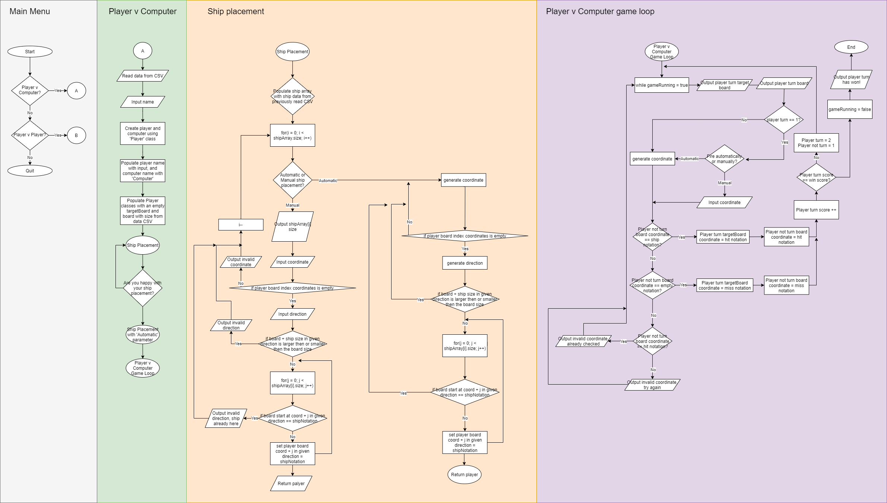

# **ADA-Ships - Kacper Kiermasz**
[Link to my code running in repl.it](https://replit.com/join/qpejpxyl-orangenotebook)
## **Challenge Outline**
In this section I will discuss the overall proposed solution to the problem, along with UML style diagrams and my initial working plan, approach and strategy. I will decompose the overall problem into smaller tasks and discuss my initial object oriented design ideas.
### **Summery and Review of the problem**
ADA Ships is a C++, object oriented (OO) clone version of the classic game 'Battleships', a two player turn based game where you and your opponent try to find and destroy each others hidden ships. The game consists of players placing down their ships on two 10 by 10 grids, followed by taking shots at the opponents grid in an alternating style. The winner is the player that manages to find and destroy all of the oppositions ships first.

My version of ADA Ships is going to contain two game modes, a single player 'Player vs Computer' mode, where the player battles an AI, and a 'Player vs Player' game mode, where two player battle each other until one of the player runs out of ships. In addition to this, my version will contain a scalable grid and battle ships; this means that the player will be able to alter the size of the board and the size / amount of battle ships available in the game via a configuration file (`adaship_config.csv`).

### **UML style diagram illustrating the initial solution**
Below are some flow diagrams that I created to help me along my development. These flow diagrams show how a 'Player vs Computer' game will run. The diagram contains the main menu, along with board creation, ship placement logic and the primary game loop for the 'Player vs Computer' game mode.



### **Initial working plan, overall approach and development strategy**
Because this challenge had a deadline, I decided to try work in a somewhat agile, iterative way. Creating an MVP quickly, and building on it over time in order to complete as much of the program as possible before the submission date. This technique would allow me to program as many working features as I was capable of in the time frame.

Quality was a big factor during development, this is because the application is quite small, so each screen or task the user interacts with has to feel easy and intuitive. Along with this, I also wanted to make sure my code was free of any significant bugs that would hinder gameplay; in order to do this I split up functions and components into separate files for easier testing, along with programming with the mindset that 'complexity in a program should come with scale'. This allowed me to keep a lot of the functions / classes created very simple.

### **Decomposition of the problem**
Because the challenge has so many parts, I decided that the best way to tackle it would be to split up the main program functionality into smaller, easier to manage tasks. This included splitting up the different game modes into separate tasks (epics), and further still splitting these up into smaller tasks (stories). 

In addition to this, I also created the [UML flow chart](#uml-style-diagram-illustrating-the-initial-solution) as a means to visualise some of these epics and stories (such as the Player vs Player game loop).

Some of the stories I created included: 
- reading from a file
- creating the player class 
- creating a coordinate generator
- creating a method to place ships
- creating a shoot function

Some of the epics I created included:
- the 'Player vs Player' game loop
- the 'Player vs Computer' game loop
- creating the ship class
- creating an interpreter to read the config

### **Initial OO design ideas**
The first thing I did in regards to the object oriented nature of the challenge was think of the different objects and the properties / methods that they would require in order to be usable in the game. This included objects such as the ships and players. I decided that objects, such as the ship object, would need to store their size along with having a method that would allow users to place them on their grid, and the player object would need to store the players name, score and boards.

## **Development**
In this section I will discuss my use of 'good' standars, along with my development phases and how I ensured that the quality of my code is high. In addition, I will also reflect on some key design challenges and my solutions to them.

### **Adoption and use of good standards**
My programming mentality during this challenge was 'complexity comes with scale'. Because of this i focused on not overcomplicating every function and making sure that each function / method does one thing, not everything. This greatly helped me when it came to refactoring code as I knew exactly what belonged where and how it affects the rest of the program. In addition to this, I made sure to follow my [UML flow chart](#uml-style-diagram-illustrating-the-initial-solution) as closely as possible, this helped me in keeping my code well structured and readable.

My iterative approach also helped in keeping clear and well flowing code, as opposed to spaghetti code. This is because instead of working on everything all at once, I built a very bare-bones MVP and reinforced it part by part. This also helped me with de-bugging as I tested often and failed fast, allowing me to resolve issues that might have of gone unnoticed otherwise.

### **Phase 1. Class creation and board configuration**
Before starting development on any of the gamemodes, I decided that I needed to code some foundations for the program. This included creating the game board, the classes / objects that I would require and reading from a configuration file. 

#### **Board creation**
This is where i met my first challenge as I was not sure how to create the board. I first tried to use a 2D `array`, but quickly switched to a `vector<vector<string>>` as it was far more scalable (this was an important factor as the board size can be changed by the player); however I still had some issues, mainly populating the board's axis.

#### **Reading from the configuration**
After creating a 10x10 board with axis, I decided to move on to reading from the configuration file. Instead of re-inventing the wheel, I copied some code I wrote from a previous ADA module that would interpret the configuration file and let me access each section of it. I then wrote some code to read these sections and determine if they relate to the board or ship. Following this I made sure I am reading all of the data correctly by printing it out in the console with the format:
```
Board size: 10x10
Boat size: 5
Boat size: 4
...
```
Finally, I took the data from the file that corresponded to board information and created a new `blankBoard` of the correct size.

#### **Class creation**
The first class I decided to create was a very basic `Player` class that contained the properties `name`, `board` and `targetBoard`. The boards were of type `vector<vector<string>>` and were equal to the `blankBoard` created when reading the configuration.

Following this, I created the `Ship` class that contained the properties `name` and `size`. At this point, I decided that I wouldn't track the ships location and status (dead or alive) in the `Ship` class, but instead as a notation on the player's boards. The notation that I came up with is as follows:
```
'| '  -> blank field on the board if board size is less then 26 (alphabet length)
'|  ' -> blank field on the board if board size is more then 26
'|S'  -> ship field on the board if the board size is less then 26
'| S' -> ship field on the board if the board size is more then 26
'|H'  -> hit field on the board if board size is less then 26 (alphabet length)
'| H' -> hit field on the board if board size is more then 26
'|M'  -> miss field on the board if the board size is less then 26
'| M' -> miss field on the board if the board size is more then 26 
```

### **Phase 2. Player vs Player - ship palcement and shooting**
Despite the requirements requesting a 'Player vs Computer' game mode first, I decided that it would be easier to start with a much more basic 'Player vs Player' MVP. With the board creation and basic `Ship` and `Player` classes completed, I started work on creating two players of type `Player`, getting their corresponding names from the users via a `cin` and setting the `targetBoard` and `board` properties equal to an `emptyBoard` 2D vector. Now all that was left was giving the players the ability to place their ships and shoot at each other.

#### **Placing ships**
To go about placing the ships I created a `place` method (later renamed to `placeShip`) in the `Ship` class. At this point I faced an abundance of challenges, the main one being converting user entered coordinates into usable coordinates. This was a problem because the board vector requires integers in order to check what is located at said index, but the coordinate input is in the format `'letter'number` eg. `F2`. 

In order to solve this, I wrote some code to first split up the provided coordinates into two parts, first the letter part then the number part. Following this, I wrote a for loop that goes through the X axis of the palyers board and compares the X axis labels to the letter part of the coordinate. If it matches, then the current loop iteration gets pushed into a new vector called `coordsVect` of type int. After this the number part (Y axis) gets pushed into said vector.

Finally, the user enters the direction of the ship, this proved to be another issue because if the direction provided makes the ship generate off of the grid the program crashes. I decided to leave this issue for now and tackle it in the next phase.

#### **Shooting**
At the end of this phase I decided to implement shooting. I reused the code to convert the user entered coordinates into int values to determine where the user wants to shoot. Following this I compared the index selected on the opponents board with the board notation to determine if the shot missed, hit or has already been tried. After this the opponents board and players targetboard get updated with the new notation or if the coordinate has already been checked the user gets propmted to shoot somewhere else.

#### **Misc.**
Along with these changes, I also worked on making placing ships possible on a larger grid. This was a challenge as it incorperated coordinates of a different format (instead of `'letter'number` eg. `F2` these could now also be `AF2` or `F21` or `AF21`). In order to tackle this I had to add checks to determine the format, and add a new check to convert larger `'letter''letter'number` format coordinates to integers.

### **Phase 3. Ship placing automation and shooting automation**
This phase consisted of adding automated options to shooting and placing ships. This phase was crucial in order for me to start development on the 'Player vs Computer' game mode as the computer would have to automatically place its ships and shoot at the player.

#### **Automatic ship placing**
The first thing I did was create a method within the `Ship` class called `generateCoord` and `generateDirection` (I later made `generateCoord` a function so that I could reuse it in the automated shooting). Following this I added a parameter to the placeShip method called `placeType`, this determines wether the ship will be placed manually or automatically. If the `placeType` is set to '1', then the user gets prompted for the ships coordinates and direction, otherwise the `generateCoord` method and `generateDirection` method are called. 

This worked, but not very well because no checks were made to see if a ship already exists in a generated coordinate, meaning many ships would spawn on top of eachother and in eachother, creating mega-ships. In addition, automated ship placing would often crash, however this was solved in Phase 4.

#### **Automatic shooting**
My process of adding an automated shooting option to the shooting function was very similar to adding the automated ship placing. I first converted the `generateCoord` method into a function, so that I could use it for more then ship related tasks. I then added a `shootOption` parameter that worked just like the `placeType` parameter but for shooting.

This worked well, however I later found out that the coordinates generated were not very random and would occasionally crash. I looked into this in Phase 4.

### **Phase 4. Testing, debugging and refactoring**
My next phase consisted of going through my code and refactoring it, along with debugging and fixing the issues I had with automated ship placement and automated shooting.

#### **Fixing coordinate generation** 
After some testing I found that my coordinate generator would occasionally generate a coordinate that did not exist on the board (eg. if the board was 10x10 it would generate `K11`). This was a simple fix and resolved a lot of issues with automatic ship placement and shooting, however fixing this uncovered a second issue.

This issue was that my random generation would not be random, so the Y and X axis of the coordinates generated was always the same. For example, `A1`, or `C3` etc. (A is the first letter in the alphabet, C is the 3rd so the X and Y matched). I had two solution to this problem, one was changing the random generation completely and the second was adding a small delay between the axis coordinate generation (this would fix the issue as my random generation is based off of system time, so waiting 1 second would mean differnet numbers would be generated). I decided to go for the second option.

#### **Refactoring**
Finally, this phase consisted of a lot of code refactoring. This mainly involved moving classes into different files, removing unneccessary variables and functions along with reafactoring in such a way that the code was easily readable. At this point I also started to add minor comments to help in readability and renamed a couple of variable for the same reason.

### **Phase 5. Player vs Computer**
This is the second to last phase, it includes working on the 'Player vs Computer' game mode, along with adding a Win state to the game.

#### **Player vs Computer**
Implementing an AI that the player faces was not as difficult as I first imagined, this is because I already had ship placement automation and shooting automation in place. In order to add the computer I copied the 'Player vs Player' code into a seporate file and altered the game loop, along with player creation.

After the bot was working, I had to implement a developer mode for testing and as part of the mark scheme. This developer mode is only available for the bot as otherwise I would not be able to test if the bot's ship placement and turn is working as intended. 

#### **Win state**
Up until this point there has been no real way to win the game, so in order to resolve this I added a property into the `Player` class called `score`. Following this I created a variable called `winScore` that was equal to the amount of spaces the oppositions ships occupied. The players `score` is incremented every time they hit their opponents ship, and the first player to get their `score` to match the `winScore` wins.

### **Phase 6. Final testing, debugging and refactoring**
In the final phase I worked on testing every part of my code, in addition to fixing any outstanding bugs, working on the main menu screen and commenting my code / updating the readme.

#### **Fixing direction generation / collisions**
Up until this point the automatic ship placement works all the time, however ships still have the capability to spawn inside other ships, making the game un-winnable because less ships take up spaces on the board then are supposed to. In order to solve this I wrote a `validateDirection` method, that checks all of the spaces a ship will spawn in and generates a new coordinate with a new direction if even one space is occupied by a ship already. 

#### **Main menu changes and input validation**
A big part of this phase was making the main menu look presentable, this included giving the user an option to choose from 'Player vs Computer', 'Player vs Player' and 'Quit'. In addition to this I worked on input validation, this included automatcially converting user inputs to the same case, along with always selecting the bottom most available option that is not 'Quit' if the user enters an unrecognised input.

## **Evaluation**
In this section I will discuss the things that went well and the things that could have of gone better, in addition to future improvements / features I did not manage to implement.

### **What went well**
Overall, I am satisfied with the quality of my ADA Ships program, it feels very intuitive to use and works as intended. My iterative approach and planning greatly helped me with development as I had something to reference whenever I was unsure about logic, in addition I am satisfied with overcoming all of the challenges mentioned during the [Development stage](#development). I also feel satisfied with the implementation of both the 'Player vs Computer' game mode and the 'Player vs Player' game mode.

The scalability of my program is also an achievement I am proud of, allowing users to play on grids that are much larger or smaller then the default size, along with being able to play with more or less ships. This feature helps to add diversity to each game, even letting the user change the size of the ships.

### **Could be better**
My main concern with this program is adding more advanced game modes might require some re-written code, this is because of the way the program handles the score and destroying ships. The `Ship` class does not store the ships status (destroyed or not) or its position, so for example adding a 'salvo' game mode would require re-writing the `shoot` function and the `Ship` class, as the program needs to know how many ships are destroyed and how many are not.

In addition to this, the current 'Player vs Computer' game mode has a very rudimentary bot that randomly fires, adding some sort of advanced AI that fires more systematically and follows up on hits would be a great addition to the game; however due to time restraints and my somewhat poor time management for this challenge I did not manage to implement this.

Finally, refactoring the automated ship placer, coordinate generator and direction generator would make the game feel far more fluid. This is because right now loading times for automated ship placement can be surprisingly long, which can be frustrating if users are trying to play multiple games.